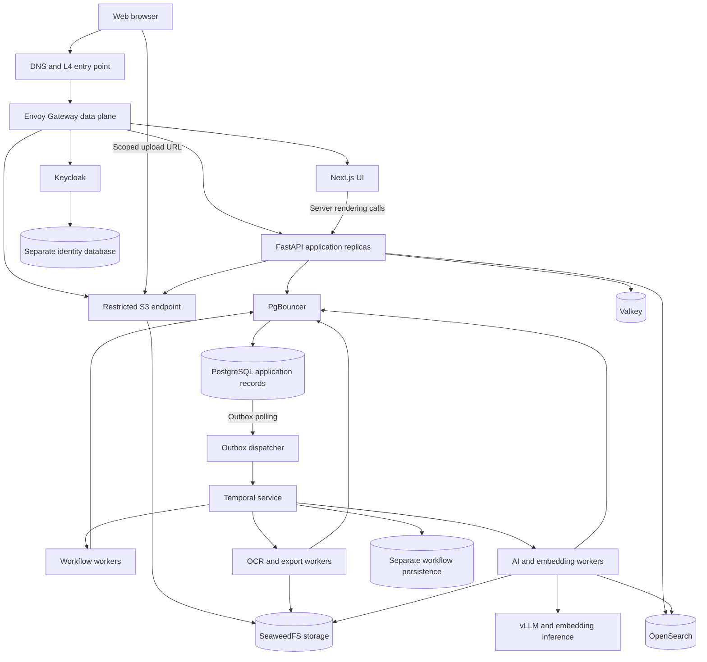
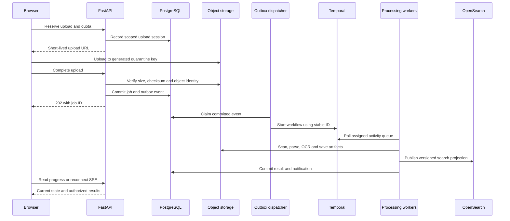

# MOAT implementation architecture

Date: 2026-09-10  
Status: Proposed implementation baseline; software and infrastructure have not been deployed.  
Product reference: [MOAT_MASTER_BLUEPRINT.md](./MOAT_MASTER_BLUEPRINT.md)

## 1. Architecture decision

Build one modular FastAPI application, a Next.js web application, and independently deployed background workers. Use PostgreSQL for authoritative business records, OpenSearch for patent retrieval, SeaweedFS for files, Valkey for disposable caching, and Temporal for background execution. Deploy locally with Compose and validate production on Kubernetes.

Tanglish: UI request API-ku varum; small operation immediate-a mudiyum. OCR, AI drafting, export madhiri heavy work job-a accept aagum. Workers capacity-ku etha maadhiri process pannum. Load increase aana API, search, CPU workers, GPU workers separate-a scale aagum.

This document defines the proposed design, implementation contracts and acceptance gates. It does not establish measured capacity or turn illustrative blueprint claims into guarantees. Exact machine sizes, model weights and software patch versions are selected through Phase 0 validation.

### Assumptions for the first production pilot

| Dimension | Planning assumption |
| --- | --- |
| Deployment | One region; enterprise production spans three failure zones |
| Customers | Up to 50 organizations; shared infrastructure with enforced tenant isolation |
| Interactive load | 500 active browser sessions; 50 requests/s sustained, 200 requests/s burst |
| Search share | Up to 10 search requests/s at the sustained workload; measured separately |
| Initial corpus | Up to 1 million patent publications; approximately 10 million selected passages |
| Private ingestion | 1,000 uploaded documents/day; public corpus backfill has a separate budget |
| Upload limits | Initial 100 MiB/file and 1,000 pages/document; tenant limits configurable |
| AI | Self-hosted inference; a model must pass patent-domain and language evaluations |
| Team assumption | 4–6 engineers plus part-time platform and patent-domain support |

These are sizing inputs, not reported current usage. A 120-million-publication corpus is a later, separately budgeted data platform milestone. A private pilot may use reduced availability, but it cannot be described as the enterprise HA deployment.

## 2. Selected stack and boundaries

| Area | Selected implementation | Stage / boundary |
| --- | --- | --- |
| Languages | TypeScript for browser/UI; Python for APIs, jobs and AI; SQL for data | No additional application language initially |
| Web | Next.js, React, Tailwind CSS, shadcn/ui, TanStack Query | One application with nine role workspaces |
| Editing | Tiptap OSS / ProseMirror; version-based autosave | Yjs simultaneous editing added in Phase 3 |
| Visualization | Apache ECharts, Cytoscape.js | Precomputed landscape coordinates; add 3D only when needed |
| API | FastAPI, Pydantic, SQLAlchemy, Alembic | REST `/api/v1`; generated TypeScript client |
| Identity | Keycloak | OIDC, MFA, federation; application does not store passwords |
| Authorization | Application permission module and PostgreSQL policies | Explicit roles, membership and resource grants; OpenFGA deferred |
| Authoritative records | PostgreSQL | Application, identity and workflow databases have separate credentials |
| Connection pool | PgBouncer | Transaction mode for compatible application workloads |
| Retrieval | OpenSearch | Boolean, BM25, filters and vectors from the search pilot onward |
| Cache | Valkey | Exact-result cache, presence and wake-up messages; never sole job storage |
| Durable execution | Temporal with Python workers | One execution system; Celery/RabbitMQ are not in this baseline |
| Objects | SeaweedFS S3 API | Original documents, extracted artifacts, models and exports |
| Parsing | Docling, Tesseract, Apache Tika where needed | XML first when available; isolated PDF conversion workers |
| Exports | python-docx, python-pptx, Gotenberg | Controlled templates; conversion service isolated |
| AI serving | vLLM; Sentence Transformers for embeddings/reranking | Model identity and dimensions versioned |
| Production routing | Envoy Gateway and Kubernetes Gateway API | Multiple Envoy data-plane replicas; cert-manager for TLS |
| Runtime | Linux, containerd, Kubernetes, Helm | Compose development profile; K8s staging and production |
| Scaling | HPA for web/API; KEDA for worker metrics | Cluster Autoscaler where supported; otherwise provision spare nodes |
| Kubernetes networking | Cilium; MetalLB for suitable bare-metal deployments | Hosted networks can use provider L4 load balancers |
| Secrets | OpenBao and External Secrets Operator | Separate recovery/unseal material and workload identities |
| Telemetry | OpenTelemetry, Prometheus, Grafana, Loki, Tempo | Metrics first; logs/traces before production pilot |
| Delivery | Forgejo Actions, Harbor, Argo CD, OpenTofu | OCI images, versioned infrastructure and GitOps |
| Verification | Pytest, Vitest, Playwright, Locust, Trivy | Behavioral tests, tenant isolation and reproducible load tests |
| Database operations | CloudNativePG; its supported backup plugin configuration | HA, WAL archival and restore exercises before production |

OpenSearch combines lexical and semantic retrieval, including score normalization or rank fusion. That supports the blueprint's analyst experience without operating a second vector engine. This is why the proposed pilot includes OpenSearch earlier than the previous discussion suggested. [OpenSearch documentation](https://docs.opensearch.org/latest/vector-search/ai-search/hybrid-search/index/)

Temporal provides persistent workflow/activity tasks and worker polling. Its task queues supply the background execution mechanism needed here; a second general job broker is unnecessary for the selected design. [Temporal task queues](https://docs.temporal.io/task-queue)

Envoy Gateway implements Kubernetes Gateway API and supports traffic controls such as rate limiting and timeouts. The community ingress-nginx retirement makes it unsuitable for a fresh deployment; this is not a statement that every NGINX product is retired. [Envoy Gateway](https://gateway.envoyproxy.io/), [Kubernetes retirement announcement](https://kubernetes.io/blog/2026/01/29/ingress-nginx-statement/)

### Open-source and version policy

Select upstream OSS editions and record the actual license of every pinned artifact in an SBOM. Next.js/FastAPI are MIT projects; PostgreSQL has the PostgreSQL License; OpenSearch and SeaweedFS use Apache-2.0; Valkey uses BSD; Temporal server uses MIT. Verify bundled dependencies, container images and extensions as part of the release inventory. [Valkey](https://valkey.io/), [SeaweedFS repository](https://github.com/seaweedfs/seaweedfs), [Temporal repository](https://github.com/temporalio/temporal)

Copyleft software can be open source: Grafana/Loki licensing and OpenBao's MPL obligations belong in that inventory. An upstream OSS edition does not automatically include commercial plugins or hosted services. Use Tiptap OSS features and self-host collaboration rather than assuming paid features are included. Container tooling can use Podman or Docker Engine; Docker Desktop is a separate product choice.

Open model weights are not automatically OSI-approved open-source AI. Select an exact model and license, record redistribution/use terms and evaluate it before adopting it. GPU hardware, network transit, domains, email delivery and patent-data rights still have costs. Cloudflare is optional commercial infrastructure, not a requirement of this stack.

Pin supported stable versions and image digests after compatibility testing; do not deploy floating `latest` tags or assume the blueprint's version numbers remain appropriate.

## 3. System topology



The arrows from Temporal to workers represent logical task delivery; worker processes initiate polling. Internet access terminates at explicitly exposed endpoints. Databases, inference services, internal administration interfaces and workflow control APIs remain private.

Only public static assets receive shared HTTP caching. Authenticated HTML/API responses use private/no-store policies unless an explicitly tenant-aware cache is designed. Multiple Next.js replicas use consistent build artifacts and compatible cache/revalidation configuration. [Next.js self-hosting guidance](https://nextjs.org/docs/app/guides/self-hosting)

## 4. Modules and the nine workspaces

| Domain module | Owns | Primary workspaces |
| --- | --- | --- |
| Identity/access | Memberships, grants, teams, tenant settings | Admin; authorization for everyone |
| Inventions | IDFs, contributors, submissions, revisions | Researcher, product manager |
| Documents/drafting | Specifications, claim sets, versions, exports | Drafter, researcher, counsel |
| Matters | Approvals, docket events, deadlines, jurisdiction metadata | Counsel |
| Search/intelligence | Corpus import, saved searches, citations, competitor monitoring | Analyst, researcher, CTO |
| Product/IP mapping | Projects, features, patent links, release reviews | Product manager, CTO |
| Portfolio/commercial | Assets, budgets, valuation assumptions, licenses, royalties | CIO, CEO |
| Collaboration | Comments, mentions, notifications, preferences | All roles |
| AI orchestration | Evidence retrieval, prompts, model runs, evaluations | Zyra and drafting/research tools |
| Reporting | Permission-scoped aggregates and report artifacts | CEO, CIO, CTO, analyst |

Modules own their tables and expose internal application interfaces. Another module cannot silently modify their records. Share one database transaction where a business invariant spans modules. Web dashboards are views over these modules; nine personas do not require nine services.

Extract a module into its own service only when measured resource contention, independent ownership or deployment cadence justifies it. Workers already provide compute isolation without splitting the whole API.

## 5. Authentication and tenant isolation

Use Keycloak OIDC authorization-code flow with PKCE. FastAPI handles the browser callback and maintains a secure, HttpOnly, SameSite session cookie; encrypted provider tokens stay server-side. Check Origin and use CSRF protection on mutations. For SSR, forward the session only to the internal API. Service clients use separate, scoped credentials. [Keycloak](https://www.keycloak.org/)

Store sessions in the application database with an expiry, membership revision and revocation status. Every protected request resolves the current user and tenant membership; never trust a client-supplied tenant ID alone. Cache public signing keys with bounded refresh behavior. Session removal takes effect immediately for protected actions; an expired session cannot survive an identity outage.

Authorization evaluates actor, tenant membership, action, resource grant and resource state. Multiple roles per user are supported. Being CEO or platform administrator does not implicitly grant every confidential matter. Record explicit support-access grants with expiry and audit events.

Application tables use `tenant_id`, tenant-safe foreign keys and PostgreSQL row policies as a second boundary. Use a non-owner application role without `BYPASSRLS`; apply transaction-local tenant context and test pool reuse. Owner/superuser behavior differs from ordinary roles, so enable FORCE RLS where appropriate. Identity and workflow service databases use their own access model. [PostgreSQL row security](https://www.postgresql.org/docs/current/ddl-rowsecurity.html)

Private search uses server-generated tenant/resource constraints before ranking. Recheck current authorization in PostgreSQL before returning snippets, sending retrieved text to a model or exporting an artifact. The pilot disables private-corpus facet counts unless they can be computed over the current authorized set. This prevents stale search ACL projections from leaking aggregate information. Cache keys include tenant, actor/access scope, permission revision, corpus revision, query and model revision.

## 6. Authoritative data model

| Group | Main entities and constraints |
| --- | --- |
| Tenancy | `tenants`, `users`, `memberships`, `roles`, `role_permissions`, `membership_roles`, `teams`, `resource_grants` |
| Resource identity | `resources(tenant_id, id, type)`; concrete documents/matters/IDFs reference this registry |
| Inventions | `inventions`, `invention_versions`, `invention_contributors`, `submissions`; multiple inventors supported |
| Portfolio | `patent_assets`, `applications`, `publication_links`, `families`; an internal asset can predate a public publication |
| Drafts | `documents`, `document_versions`, `claim_sets`, `claims`, `claim_dependencies` |
| Legal operations | `matters`, `decisions`, `deadline_events`, `deadline_rules`, `deadline_acknowledgments` |
| Collaboration | `comments`, `comment_anchors`, `mentions`, `notifications`, `notification_preferences` |
| Execution | `jobs`, `job_attempts`, `outbox_events`, `consumer_receipts`, `workflow_links`, `failed_jobs` |
| Search provenance | `data_sources`, `import_batches`, `source_objects`, `publications`, `citations`, `index_manifests` |
| AI provenance | `analysis_runs`, `evidence_links`, `model_versions`, `prompt_versions`, `evaluation_runs` |
| Commercial/product | `products`, `features`, `feature_patent_links`, `budgets`, `valuation_runs`, `licenses`, `royalty_entries` |
| Audit/integration | `audit_events`, `integration_connections`, `webhook_deliveries`, `retention_holds` |

Public patent metadata belongs to a separate corpus schema and database role. Private customer data always carries tenant ownership. Separate the corpus database physically when import I/O competes with transactional traffic.

Required constraints and indexing:

- Reference tenant-owned rows with composite keys such as `(tenant_id, document_id)`; a bare UUID FK alone does not prevent cross-tenant links.
- Use `UNIQUE(tenant_id, parent_id, revision)` on versioned records and optimistic concurrency on the current revision pointer. Conflicting edits return `409`.
- Preserve submitted/approved claim sets as immutable snapshots. A change creates a new revision and invalidates approval of the old revision for the new content.
- Represent claim dependencies as edges, supporting multiple parents. Validate same claim set, valid numbering and cycle prevention under a lock on the claim set, preventing concurrent cycle creation.
- Comments reference the resource registry and document revision. Anchors store stable block IDs and text ranges; unresolved anchors after edits are visibly marked.
- Index common access paths beginning with tenant and relevant status/date, such as `(tenant_id, status, updated_at, id)`. Use cursor pagination.
- Store monetary amount and currency; valuation runs include assumptions, source dates and methodology version.
- Deadline events include jurisdiction, local date/time zone, triggering event, calculation version, responsible person and confirmation state. Preserve recalculation history.
- Restrict application mutation of audit records. Export signed/tamper-evident audit batches to a separately controlled retention store; an append-only table alone is not immutable against a privileged operator.
- Partition audit/event history only when retention and measured volume justify it. Do not partition every table upfront.

Original files and extraction artifacts live in object storage. PostgreSQL stores hashes, ownership, revisions and artifact manifests; OpenSearch contains rebuildable search projections. Embeddings are generated once per content/model revision and archived for reindexing where storage cost warrants it.

## 7. API and transaction contracts

| Endpoint | Contract |
| --- | --- |
| `POST /api/v1/inventions` | Creates an authorized draft; returns `201` and revision |
| `POST /api/v1/uploads` | Reserves quota and creates a bounded upload session |
| `POST /api/v1/uploads/{id}/complete` | Verifies object metadata/checksum; durably accepts processing |
| `POST /api/v1/inventions/{id}/analyses` | Returns `202`, job ID and status URL after a DB commit |
| `POST /api/v1/submissions/{id}/decisions` | Decision on an explicit document revision; idempotent |
| `POST /api/v1/search` | Validated query grammar, authorization, cursor and bounded result size |
| `GET /api/v1/jobs/{id}` | Durable progress, failure category, artifact references |
| `GET /api/v1/events` | Authorized SSE notifications with a reconnect cursor |
| `POST /api/v1/reports` | Queued report request with snapshot/scope recorded |

Use one error schema with code, human-readable message and request ID. Document endpoint permissions in OpenAPI. Mutation requests carry an idempotency key scoped to tenant, actor and operation; retain the request digest and prior result. Reusing a key for a different body is a conflict.

In one PostgreSQL transaction, write the domain change, audit event, job/admission reservation and outbox event. An outbox dispatcher uses short leases and `FOR UPDATE SKIP LOCKED`, delivers to a deterministic workflow ID and records successful delivery only afterward. A crash can cause redelivery; duplicate starts and activity writes must be safe. Retain a deduplication ledger beyond the workflow history retention window.

Activities use stable operation IDs, unique constraints, content-addressed artifacts and bounded retries. Email/webhook effects may still be duplicated when the receiver lacks deduplication support; expose delivery IDs and audit attempts. Do not claim exactly-once external delivery.

## 8. Main execution flows

### Document ingestion



Generate object keys server-side. Use multipart uploads, enforce byte limits at the S3 endpoint, and abort expired/incomplete uploads. Files remain quarantined until MIME validation, antivirus checks and parser limits pass. Disable parser network access and enforce CPU, memory, decompression and page-count limits. OCR only pages that need it; native patent XML takes precedence over PDF OCR. [Docling project](https://github.com/docling-project/docling)

Job payloads carry IDs and artifact references. File bytes, full patent text and model outputs do not belong in workflow history. A completed upload means accepted processing; the UI separately shows scanning, extracting, indexing, ready or failed.

### Search and AI analysis

1. Resolve access and validate Boolean/CPC/date/jurisdiction filters; cap query complexity.
2. Consult an exact-query cache scoped to permission and corpus revisions. Semantic answer caching is disabled initially because near-matching legal questions may differ materially.
3. Query BM25 and vectors over the allowed corpus, merge candidates and apply a measured reranking budget.
4. Reauthorize private candidates, then send only approved passages to the inference service.
5. Save an analysis revision containing passage IDs, source dates, retrieval/model/prompt versions and evidence mappings.
6. Return search hits promptly; run long analysis as a job. Persist draft output periodically and publish progress through the event channel.

Ranking, claim coverage and expert review are separate fields. The blueprint's inverse-vector "novelty percentage", automatic `>80%` approval and guaranteed FTO indicator are not implementation rules. UI states are evidence available, review pending, approved by named reviewer, or insufficient evidence. Scores describe their method and limitations.

Public corpus and private invention indexes are separate. Track publication identifiers including jurisdiction and kind code; normalize applicants, families, classifications, dates and citations without discarding source values. Checkpoint imports and record source rights, fetch time and coverage. Competitor alerts are generated from observed publications, not assumed visibility into unpublished filings.

At large scale, retrieve publication-level candidates first and selected claim/description passages second. Benchmark recall before reducing passages or quantizing vectors. Use versioned indexes, rebuild manifests, alias cutovers and replayable imports for model/schema changes.

### Review, deadlines and notifications

The application database owns the accepted business state; the workflow coordinates follow-up actions. A decision transaction locks/checks the submission revision, validates current permissions, saves the decision and emits an outbox event. A retry cannot approve another revision accidentally.

Maintain a workflow per matter or bounded business process, with history rollover/versioning planned before long-running use. Scheduled activity work references recorded deadline events. An independent deadline scanner compares database due dates with acknowledgments and delivery status, so workflow lag produces an operational alert. Notification delivery is not proof that a person acknowledged a deadline.

Notifications are persisted before realtime delivery. Valkey pub/sub is only a wake-up hint; SSE reconnects replay database events by cursor and refetch state after cursor expiry. Scale SSE by open connections and memory, configure heartbeat/idle timeouts, and drain connections on deployment.

Email uses a configured SMTP integration; use a local mail sink in development. Slack/Teams integrations use explicit tenant configuration, secret references, signed/idempotent webhook delivery where supported and per-destination retry budgets.

### Collaborative drafting

Phase 1 uses autosave with revision checks and immutable review snapshots. Phase 3 introduces Yjs through a TypeScript collaboration gateway; this is a separate realtime component, not a second business API. [Yjs project](https://github.com/yjs/yjs)

Use one leased room owner per document and fan out updates through that owner. A persist-before-durable-ack protocol writes updates via the document module; reconnect replays persisted state. On owner failure, acquire a new lease and rebuild the room. Enforce permissions at join and during a session, fence stale owners, bound update size, compact updates and test concurrent reconnects. Claim semantic validation and final approval always operate on a server-validated snapshot.

## 9. Load balancing, buffering and dynamic scaling

There are four controls: route requests across healthy replicas; admit only affordable work; buffer accepted jobs durably; add workers/nodes within dependency and budget limits. Autoscaling cannot make an overloaded database or unavailable GPU capacity disappear.

| Workload | Queue/deployment | Starting floor / ceiling for testing | Primary measurement |
| --- | --- | --- | --- |
| Web/API | Separate stateless deployments | Web 2/8; API 2/12 | CPU, in-flight requests, p95 latency |
| Workflow coordination | `moat-workflow` | 2/6 workers | Scheduling latency and worker availability |
| Interactive AI | `moat-ai-interactive` | 1/8 workers | Admitted work, wait time, inference capacity |
| OCR/parsing | `moat-ocr` | 1/12 workers | Pending work and observed seconds/page |
| Bulk indexing | `moat-index` | 1/8 workers | Backlog age and search write pressure |
| Exports | `moat-export` | 1/4 workers | Queue age and active conversions |
| Notifications | `moat-notify` | 2/6 workers | Delivery lag and recipient throttles |
| GPU serving | Dedicated model deployments | Hardware/model dependent | Pending tokens, latency and GPU memory |

These are bounded experiment settings, not validated production capacities. Critical coordination and notification workers retain spare capacity. CPU-intensive jobs use dedicated node pools; GPU models are loaded separately from workers that call them. Warm GPU capacity is required for predictable interactive latency.

Publish application-owned pending-job and oldest-job-age gauges to Prometheus. Use KEDA's Prometheus scaler for worker demand, with explicit caps and a monitored exporter. Do not assume a RabbitMQ scaler applies to Temporal, or that an SDK latency metric alone wakes a zero-replica deployment. Start with a worker floor of one; allow scale-to-zero only after the external demand signal is demonstrated. [KEDA Prometheus scaler](https://keda.sh/docs/2.20/scalers/prometheus/)

Gateway controls include request-body limits, short request deadlines, connection limits, per-IP abuse protection and tenant/API rate limits. Enable retries only for safe/idempotent operations and keep one retry owner per boundary. Reserve separate budgets for interactive and bulk work. HPA scales pods; Cluster Autoscaler or another infrastructure integration must provide nodes.

Admission control reserves per-tenant running/pending capacity atomically with the job. Initial configurable caps: 2 running interactive analyses, 20 pending analyses, 2 OCR jobs, 100 pending documents and 1 export per tenant. Enforce these in PostgreSQL; Valkey accelerates approximate edge throttling. Global caps also protect search, inference and storage. A fair dispatcher rotates tenants, and expired reservations reconcile against durable job status.

When capacity is exceeded, return `429` with retry guidance for tenant limits or `503` for system-wide unavailability before accepting a job. Once `202` is returned, the job remains queryable and reaches completed, failed or cancelled. Cancellation is cooperative and does not undo already committed side effects.

Limit each activity's execution time, total retry duration, concurrency and payload size. Retried failures use backoff/jitter. Permanent or exhausted jobs appear in `failed_jobs` with an operator retry action and lineage; Temporal does not automatically provide the RabbitMQ-style dead-letter queue from the earlier stack proposal. Avoid hot retry loops and unbounded workflow histories.

### Capacity calculations

Measure service time with representative patents, not only tiny sample files:

```text
required worker replicas >= ceil(arrival_rate * mean_service_time / (concurrency_per_worker * target_utilization))

Example: 0.5 OCR jobs/s * 40 s/job / (2 jobs/worker * 0.65) = 15.39 -> 16 workers
```

That example exceeds the initial OCR ceiling of 12: it requires a larger ceiling/node budget or lower admission rate. A queue absorbs a burst but cannot absorb a permanently higher arrival rate than processing capacity. Estimate drain time as `backlog / (service_rate - arrival_rate)` only when service rate exceeds arrival rate.

For the pilot vector assumption, `1M publications * 10 passages * 768 dimensions * 4 bytes` is 30.72 GB of raw vectors. At 120M publications it is 3.6864 TB before graph indexes, metadata, replicas, original text and free disk headroom. Real passage counts and storage overhead must be measured; public PDFs can dominate storage.

PgBouncer bounds and reuses server connections; it does not multiply database compute by 100. For example, with a chosen database budget of 200 connections, reserve 40 for operations/other services and cap all application pooler server connections at an aggregate 160. Divide that budget across pooler replicas, databases and roles, since individual pools can multiply. Bound client wait time and monitor pool waits. [PgBouncer configuration](https://www.pgbouncer.org/config.html)

## 10. Availability, security and recovery

Enterprise production uses three failure zones, topology spread and disruption budgets. CloudNativePG manages a primary and two standbys on independent storage/failure domains. Select synchronous acknowledgment from one standby where the latency/availability tradeoff is acceptable. Strict synchronous settings can pause writes after loss of healthy standbys; do not silently weaken durability. Separate app, identity and Temporal clusters when their measured load warrants it. [CloudNativePG documentation](https://cloudnative-pg.io/docs/)

OpenSearch needs quorum-capable cluster management and data replicas across failure domains. A three-node mixed-role pilot is a starting topology; dedicated manager/data roles are a later capacity choice. Failover behavior, shard recovery and disk watermarks are tested under load. Scale stateful stores through planned capacity changes, not CPU-only pod autoscaling.

SeaweedFS production must cover master quorum, volume replication and durable filer metadata, with replicated S3/filer entry points. Choose a supported filer metadata store and include it in restore tests; merely running an S3 container is not HA. Start with replication for active files and evaluate erasure coding for appropriate cold data. Validate the required S3 multipart, encryption, lifecycle and retention behavior in Phase 0. [SeaweedFS](https://github.com/seaweedfs/seaweedfs)

| Failure | Intended behavior |
| --- | --- |
| API pod dies | Another replica serves new requests; idempotency handles caller retries |
| OCR/AI worker dies | Unfinished work retries safely; persisted artifacts can be reused |
| Temporal unavailable | Core reads/draft edits continue; accepted jobs remain in a capped DB outbox; admission stops at cap |
| OpenSearch unavailable | Drafting/matters remain usable; search shows unavailable, never misleading zero results |
| GPU/inference unavailable | Retrieval remains usable; analysis shows delayed or failed with explicit status |
| Valkey unavailable | Correctness uses PostgreSQL; shed excess traffic rather than flooding the DB |
| PostgreSQL unavailable | Mutations fail; no false acknowledgment of saved edits or approvals |
| Object store unavailable | New uploads/exports fail or wait within their job deadline; committed metadata remains visible |
| Identity unavailable | Existing valid application sessions follow stored expiry/revocation; new login/refresh fails |
| Zone unavailable | Surviving replicas serve within tested failover limits and remaining capacity |

Use private networks and default-deny policies for services, encryption in transit and encrypted disks/object data. OpenBao supplies short-lived credentials where supported. Keep recovery keys outside the cluster they recover. Suppress patent text, secrets and model prompts from ordinary logs; observability access is tenant/admin scoped. [OpenBao](https://github.com/openbao/openbao)

AI receives retrieved text as untrusted evidence; documents cannot instruct tools to change permissions or approve matters. Write-capable AI actions use explicit application commands with current actor permissions and the relevant human review step. Inference endpoints have token/context/concurrency budgets and no unrestricted public access. [vLLM documentation](https://docs.vllm.ai/en/latest/)

Restore targets below are proposed objectives, verified by drills:

- Same-region primary failure: zero loss of synchronously acknowledged database commits under the configured failure model; target service restoration within 5 minutes.
- Regional disaster: target RPO at most 15 minutes and essential-service RTO at most 4 hours; object replication and WAL archive lag both count.
- Run WAL archival plus scheduled database backups using CloudNativePG's supported backup tooling. Back up identity and workflow persistence as well as application records.
- Replicate objects and manifests to a separately controlled location; back up filer metadata, configuration and recoverable secrets. Use OpenSearch snapshots to speed recovery rather than relying on a full corpus rebuild inside four hours.
- Restore the DB, workflow state and objects to compatible recovery points. Reconcile dangling manifests, job completions and outbound deliveries before resuming work. DR region remains read-only until the old writer is fenced.
- Exercise isolated restores monthly and a regional failover scenario before offering the enterprise recovery targets. Measure partial versus full corpus availability explicitly.

A legal hold blocks deletion of covered artifacts. Ordinary deletion removes access first, propagates to search/cache/artifacts, and follows defined backup expiry. Retention and residency settings are tenant configuration, including workflow payloads, audit data and backups.

## 11. Observability and release gates

Propagate a request/job correlation ID through gateway, API, outbox, workers, retrieval and inference. Use OpenTelemetry for instrumentation, with sensitive fields removed before export. [OpenTelemetry](https://opentelemetry.io/docs/)

Proposed pilot SLOs at the stated load and measured hardware:

| Measure | Proposed target |
| --- | --- |
| Core authenticated APIs | 99.9% monthly successful service availability |
| CRUD latency | p95 under 500 ms at gateway; excludes file transfers and async AI |
| Search latency | p95 under 2 seconds for retrieval without LLM generation |
| Job submission | p95 under 500 ms to durable acceptance |
| Interactive job start | p95 under 10 seconds with warm admitted capacity |
| Notification visibility | p95 under 5 seconds from committed notification |
| Deadline scanner lag | Alert when more than 60 seconds behind its configured schedule |
| Index freshness | p95 under 5 minutes for normal incremental updates |

Report overload rejections alongside successful-request latency; system-caused `503`s count against availability. Track p99, error rate, pool wait, queue age, search indexing lag, worker retries, GPU wait, backup lag and per-tenant cost. Model generation and OCR duration receive separate SLOs after representative benchmarking.

Release tests must prove: cross-tenant access is blocked through APIs/search/cache/SSE/exports; concurrent approvals reference the correct immutable revision; duplicate deliveries do not duplicate domain changes; revoked access cannot reach AI context; worker crashes recover; lost realtime hints are replayed; malformed PDFs are bounded; dependency failures expose honest status; backups actually restore.

Run sustained, burst and soak tests with realistic search/CRUD/upload mixes and cold/warm caches. The pilot acceptance workload is 50 requests/s sustained and 200 requests/s for a bounded five-minute burst, plus an independent ingestion load. Simulate model latency where needed but label simulated results. The blueprint's 5,000 virtual users are a later benchmark profile, not proof of 5,000 simultaneous searches or any particular throughput.

## 12. Repository and delivery structure

Proposed new application layout; existing deleted worktree files are not restored by this plan:

```text
apps/
  web/                     # TypeScript Next.js
  api/                     # FastAPI routing and domain modules
  workers/                 # Workflow and activity entry points
  collaboration/           # Phase 3 Yjs gateway
packages/
  domain/                  # Shared Python application services
  api-client/              # Generated TypeScript OpenAPI client
  ui/                      # Shared UI components
infra/
  compose/                 # Local core + optional AI profiles
  helm/                    # Services and environment values
  tofu/                    # Network, nodes, disks, DNS
  gitops/                  # Argo CD applications
tests/
  integration/
  security/
  e2e/
  load/
docs/
  adr/
  runbooks/
```

CI runs lint/type checks, migration checks, behavioral tests and dependency/image scans, then builds signed, immutable images and an SBOM. Promote the same digest through staging and production. Use expand/contract migrations: add compatible schema, deploy compatible code, backfill, then remove obsolete schema in a later release. Long-running workflows require compatible worker versions; a web rollback alone does not roll back workflow histories or data.

Keep development, staging and production credentials and storage separate. Local core uses single-node stores and a clearly labeled test model; it cannot demonstrate HA. Staging exercises the production topology at lower data volume. Secrets never enter source control or build arguments.

## 13. Implementation phases and completion criteria

| Phase | Deliverable | Exit criterion |
| --- | --- | --- |
| 0 — validate assumptions | Source access/rights, representative corpus, model evaluation, pinned compatibility matrix, infrastructure budget | Measured import/search/inference costs; S3 features verified; initial jurisdiction scope recorded |
| 1 — one complete product path | Login, tenant permissions, IDF editor, upload, job/outbox, OCR, OpenSearch, analysis evidence, legal decision, notification | Researcher submits one IDF and counsel reviews its exact revision; negative access tests pass |
| 2 — production pilot | HA deployment, bounded admission, autoscaling, monitoring, backup/restore, operator runbooks | Pilot load/SLO and failure/restore tests pass on declared hardware |
| 3 — complete workspaces | Drafting/claim tools, docketing, collaboration, product mapping, competitor monitoring, exports | Each of the nine roles completes its blueprint workflow with correct access and audit history |
| 4 — portfolio intelligence | Budget/valuation models, licensing records, executive reports, landscape analysis | Reports trace to authorized records and versioned assumptions; domain reviewer signs off on methodology |
| 5 — corpus and regional expansion | Corpus/transactional DB separation, shard sizing, tiered retrieval, optional service extraction, regional DR | Larger-corpus recall/cost benchmarks and recovery targets pass before expanding commitments |

First vertical slice: **researcher login → IDF upload → extraction → prior-art retrieval → evidence-linked analysis → counsel decision → notification**. Implement and verify this across real components before building all nine dashboards in isolation.

Planning estimate under the stated team assumption: approximately 2–3 weeks for validation/foundation, another 4–6 weeks for the vertical slice, and 4–6 weeks for pilot hardening, with feature completion and large-corpus expansion planned from evidence afterward. These are engineering estimates, not delivery commitments. The blueprint's complete 20-day enterprise launch has no supporting scope/capacity evidence.

Phase 0 resolves the remaining deployment inputs: actual tenant/concurrency forecast, initial corpus rights/size, GPU and hosting budget, residency needs and first supported jurisdictions. Until then, use the explicit pilot assumptions above; do not represent the proposed limits as measured capacity.

## 14. Decisions changed from the original blueprint

| Original assumption | Proposed implementation |
| --- | --- |
| Community NGINX ingress | Envoy Gateway / Gateway API |
| Mandatory Cloudflare | Optional provider edge; explicit self-hosted origin controls and upstream network protection |
| Three independent search/graph stores | OpenSearch retrieval; PostgreSQL claim/citation edges; specialized graph store only after measured need |
| Redis semantic cache with universal sub-80 ms response | Valkey exact-result caching with tenant/version scope and measured latency |
| Celery plus an additional workflow system | Temporal workflow/activity workers for the selected workload |
| One role per user | Tenant memberships with multiple roles and resource permissions |
| Parent-only claim tree | Versioned claim graph with multiple dependency edges |
| Large PDFs through application processing | Scoped direct uploads, quarantine and bounded processing jobs |
| Automatic novelty-score legal approval | Evidence-backed analysis and named reviewer decisions |
| PgBouncer guarantees 100x DB concurrency | Explicit global connection and query-capacity budgets |
| HPA alone provides dynamic capacity | Admission limits, dependency-aware worker scaling and provisioned node/GPU capacity |
| 120M patents as a day-one assumption | Separately sized and licensed corpus expansion milestone |

The design is ready to guide implementation of the first vertical slice. Production readiness is earned through the phase exit criteria above.
