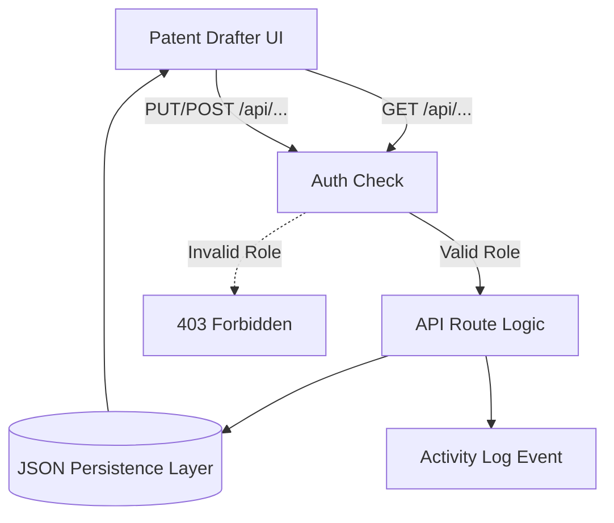

# Patent Drafter Workspace Architecture Blueprint

## 1. Directory Structure & File Locations

### Frontend Structure (Next.js App Router)
The new workspaces will be built natively into the existing Next.js dashboard routing structure:

```text
apps/web/src/app/(app)/dashboard/patent-drafter/
├── documents/
│   ├── layout.tsx                  # Shared tab navigation
│   ├── disclosures/page.tsx        # View original invention disclosure
│   ├── prior-art/page.tsx          # View linked research patents
│   ├── drawings/page.tsx           # Upload/View patent drawings
│   └── export-files/page.tsx       # Download generated DOCX/PDF
├── review/
│   ├── layout.tsx                  # Shared tab navigation
│   ├── annotations/page.tsx        # Granular feedback on draft text
│   ├── approvals/page.tsx          # Submission state and decision logs
│   └── feedback-logs/page.tsx      # Historical aggregated feedback
├── docket/
│   ├── layout.tsx
│   ├── deadlines/page.tsx          # System-generated overdue trackers
│   ├── reminders/page.tsx          # User-configured time alerts
│   └── action-items/page.tsx       # Aggregate of blocked workflows
└── reports/
    ├── layout.tsx
    ├── drafting-metrics/page.tsx   # Aggregated workload metrics
    ├── time-tracking/page.tsx      # Manual billable/drafting hours
    └── productivity/page.tsx       # Turnaround time analytics
```

### Backend API Structure (Next.js Route Handlers)
Given the environmental constraints, we will continue expanding the persistent Next.js JSON fallback API pattern to mock the SQLAlchemy behaviors flawlessly:

```text
apps/web/src/app/api/patent-drafter/
├── documents/route.ts      # GET/POST (disclosures, drawings, exports)
├── annotations/route.ts    # GET/POST/PUT (threaded document feedback)
├── review/route.ts         # GET/PUT (approval state machine logic)
├── docket/route.ts         # GET/POST/PUT (reminders & system deadlines)
└── reports/route.ts        # GET/POST (time records and metric queries)
```
*Note: Data will persist securely locally in the `/data/*.json` directory.*

## 2. Data Relationships & Schema (JSON Implementation)

To fulfill the missing functionality observed in Phase 0, we will manage the following entity relationships natively:

1. **Documents (`data/documents.json`)**
   - Maps `invention_id` -> Array of Document Objects (Disclosures, Drawings, PriorArt, Exports).
   - Tracks `status` (verified, scanning), `file_url`, and `uploader_role`.

2. **Annotations (`data/annotations.json`)**
   - Maps `draft_id` -> Array of Comment Objects.
   - Tracks `target_passage` (specific claim or text snippet), `author`, `resolution_status`.

3. **Reminders (`data/docket.json`)**
   - Maps `user_id` -> Array of Reminder Objects.
   - Tracks `due_date`, `related_invention_id`, `status` (active, dismissed).

4. **Time Records (`data/reports.json`)**
   - Maps `invention_id` & `drafter_id` -> Array of Session Objects.
   - Tracks `duration_minutes`, `task_description`, `timestamp`.

## 3. Data Flow & Authorization Rules

**Workflow Flow:**


**Authorization Enforcement:**
- **Read Access:** A Drafter may only GET documents, reviews, or dockets associated with their *explicitly assigned* `invention_id`.
- **Write Access:** 
  - A Drafter can POST to `/documents` (upload drawings).
  - A Drafter can PUT to `/review` (submit for review) ONLY if the current status is `DRAFTING` or `REVISION_REQUIRED`.
  - A Drafter **CANNOT** PUT an `APPROVED` status to `/review` (Blocked by RBAC).
- **Time Records:** A Drafter can only POST time records under their own user identity.

## 4. Implementation Phase Plan

- **Phase 2 (Documents):** Implement the four document views (Disclosures, Prior Art, Drawings, Exports) and the associated `/documents` API.
- **Phase 3 (Review & Collaboration):** Implement Annotations, Approvals, and Feedback Logs, ensuring the API strictly enforces state transitions.
- **Phase 4 (Docket):** Implement upcoming Deadlines, Reminders, and actionable items.
- **Phase 5 (Reports):** Implement Time Tracking and Productivity metric aggregation views.
- **Phases 6-10:** Execute rigorous security, UX, and E2E testing sweeps across all modules.
